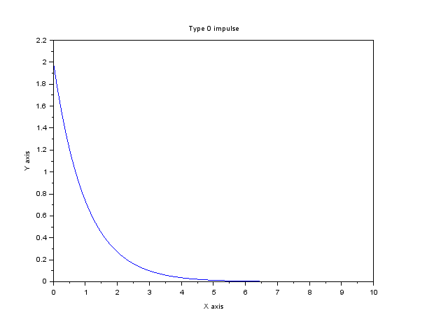
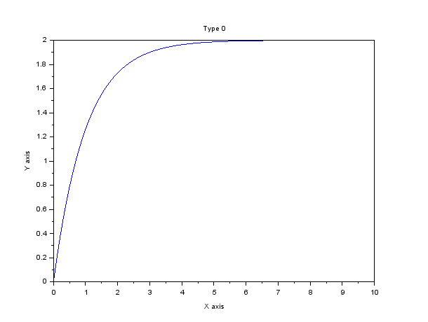
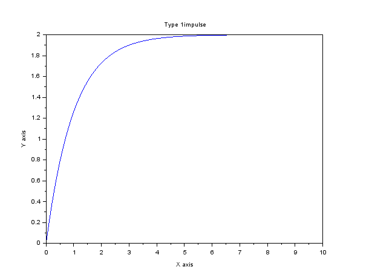
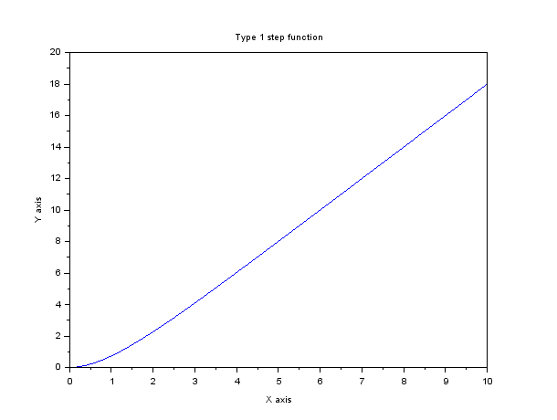
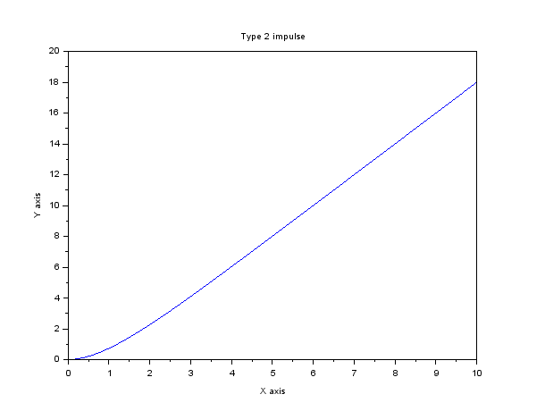
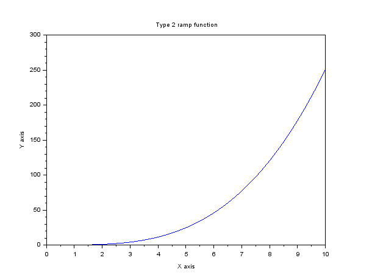
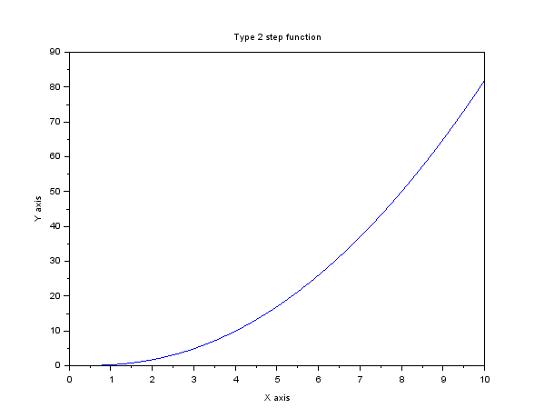

# Type 0
<h1> Code </h1>
s = %s 
sysl = syslin('c',2,(s+1));  
xtitle( 'Type 0 impulse', 'X axis', 'Y axis' ) ;  
t =0:0.1:10;  
y = csim('imp',t,sysl)  
plot(t,y)  

 s = %s 
sysl = syslin('c',2,(s+1));  
xtitle( 'Type 0 ramp function', 'X axis', 'Y axis' ) ; 
u =t; 
t =0:0.1:10; 
y = csim(u,t,sysl) 
plot(t,y) 

 s = %s 
sysl = syslin('c',2,(s+1)); 
xtitle( 'Type 0', 'X axis', 'Y axis' ) ; 
t =0:0.1:10; 
y = csim('step',t,sysl) 
plot(t,y) 

# Type 1
 s = %s 
sysl = syslin('c',2,s*(s+1)); 
xtitle( 'Type 1impulse', 'X axis', 'Y axis' ) ; 
t =0:0.1:10; 
y = csim('imp',t,sysl) 
plot(t,y) 

 s = %s 
sysl = syslin('c',2,s*(s+1)); 
xtitle( 'Type 1 ramp function', 'X axis', 'Y axis' ) ; 
u =t; 
t =0:0.1:10; 
y = csim(u,t,sysl) 
plot(t,y) 

 s = %s 
sysl = syslin('c',2,s*(s+1)); 
xtitle( 'Type 1impulse', 'X axis', 'Y axis' ) ; 
t =0:0.1:10; 
y = csim('step',t,sysl) 
plot(t,y) 

# Type 2
 s = %s 
sysl = syslin('c',2,s*s*(s+1)); 
xtitle( 'Type 2 impulse', 'X axis', 'Y axis' ) ; 
t =0:0.1:10; 
y = csim('imp',t,sysl) 
plot(t,y) 

 s = %s 
sysl = syslin('c',2,s*s*(s+1)); 
xtitle( 'Type 2 impulse', 'X axis', 'Y axis' ) ; 
u =t; 
t =0:0.1:10; 
y = csim(u,t,sysl) 
plot(t,y) 

 s = %s 
sysl = syslin('c',2,s*s*(s+1)); 
xtitle( 'Type 2 impulse', 'X axis', 'Y axis' ) ; 
t =0:0.1:10; 
y = csim('step',t,sysl) 
plot(t,y) 

