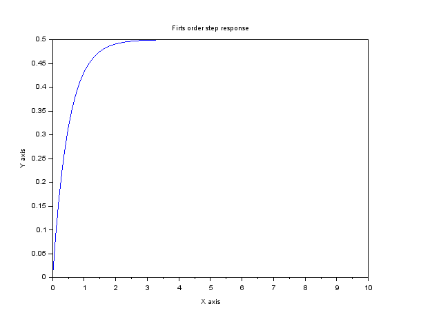
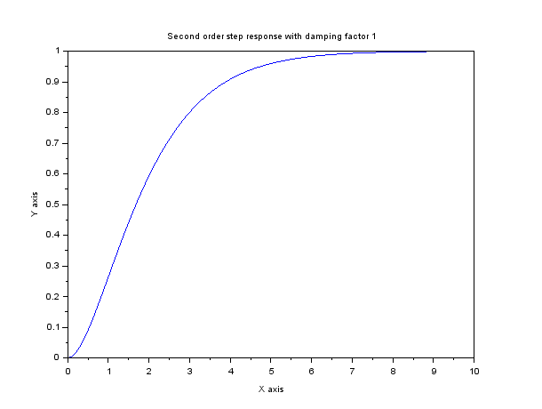
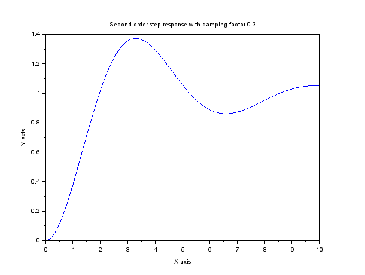
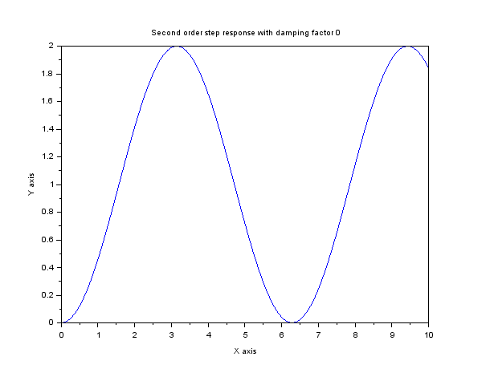
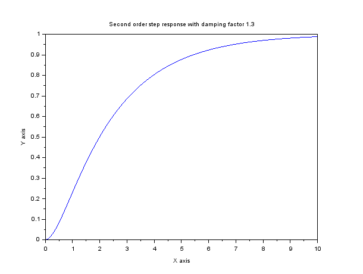

# Order 1 Step reponse
 s = %s 
sysl = syslin('c',1,s+2); 
xtitle( 'Firts order step response', 'X axis', 'Y axis' ) ; 
t =0:0.1:10; 
y = csim('step',t,sysl) 
plot(t,y) 

# Order 2 step response with  different damping factor
 <h2> Damping factor 1</h2> 
  s = %s 
sysl = syslin('c',1,(s * s + 2 * s + 1)); 
xtitle( 'Second order step response with damping factor 1', 'X axis', 'Y axis' )  
t =0:0.1:10; 
y = csim('step',t,sysl) 
plot(t,y) 

 <h2> Damping factor 0.3</h2> 
 s = %s 
sysl = syslin('c',1,(s * s + 0.3 * 2 * s + 1)); 
xtitle( 'Second order step response with damping factor 1', 'X axis', 'Y axis' )  
t =0:0.1:10; 
y = csim('step',t,sysl) 
plot(t,y) 

 <h2> Damping factor 0</h2> 
 s = %s 
sysl = syslin('c',1,(s * s + 1 )); 
xtitle( 'Second order step response with damping factor 0', 'X axis', 'Y axis' )  
t =0:0.1:10; 
y = csim('step',t,sysl) 
plot(t,y) 

 <h2> Damping factor 1.3</h2> 
 s = %s 
sysl = syslin('c',1,(s * s + 1.3 * 2 * s + 1)); 
xtitle( 'Second order step response with damping factor 1.3', 'X axis', 'Y axis' )  
t =0:0.1:10; 
y = csim('step',t,sysl) 
plot(t,y) 

